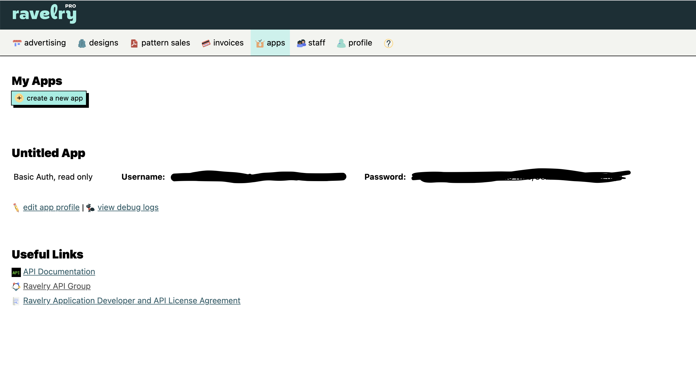

# README

Versions:

- Ruby 2.7.5
- Rails 7.0.2.3
- Bundler version 2.3.11

This is the back end of an app for querying the [Ravelry API](https://www.ravelry.com/api) and displaying results. [The front end, done in Vue, lives here](https://github.com/graceolivia/yarn-detective-8-front-end).

## Setup, creating Ravelry Account and getting credentials for connecting to the Ravelry API

First, clone the app and cd into the directory. Run the bundle command.
```
cd yarnDetective8Backend
bundle
```

Important step: In order to work with the Ravelry API, this app uses Read-Only HTTP Basic Auth access. If you're going to run the machine locally, you'll have to set up your own account and access key.

### Ravelry setup

1. Go to [Ravelry.com](https://www.ravelry.com/account/login) and hit "sign up" to create an account if you don't have one already. Enter your email, and they will send you a signup link. Create account and password.


2. After the pro account is made, while still signed in, visit this link to set up your [Ravelry Pro](https://www.ravelry.com/businesses/new?plan_type=6) account. You don't need to put in your real address or a real business name, but the business name will be used to create your pro account. Select `Developer Account - Ravelry API Access` from the dropdown menu.


3. While logged in, visit the [this link](https://www.ravelry.com/pro/developer) and click on the button to create a new app. Select `Basic Auth: read only access` from the dropdown.


4. You will be redirected to your apps page. Click the "show" link next to password. This is your key and password you need to access the API. Save these.



5. This repository contains a `credentials.yml.enc` file. You'll need to delete it and generate your own.

`rm config/credentials.yml.enc`

Then run:

`EDITOR="vim" rails credentials:edit`

Then, in that file, enter your keys as seen below (be sure to put them in quotes):
```
ravelry:
  username: "{INSERT YOUR USERNAME FROM RAVELRY}"
  password: "{INSERT YOUR PASSWORD FROM RAVELRY}"
```

This will allow access to the read-only routes that we need for this app.

## Running App

To run after cloning and setup:
```
rails s
```

To test:
```
rake test
```


To lint:

```
rubocop --require rubocop-rails
```

To lint with autocorrect:

```
rubocop --auto-correct-all
```

## Instructions for use

This project is a back end server serving JSON data from the Yarn search from the Ravelry API. In order for it to work with the front end, it must be running on port 3000.

To query the API, use this route:

`http://127.0.0.1:3000/api/yarns?query={QUERY GOES HERE}`

The intended use is with [the Vue front end](https://github.com/graceolivia/yarn-detective-8-front-end).
